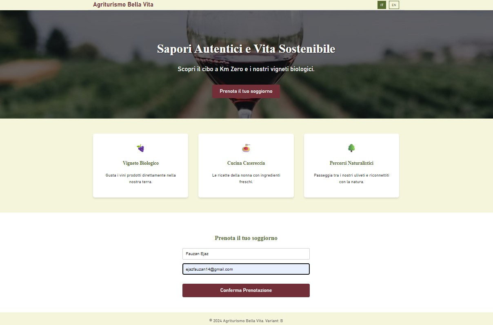

# 🍷 Agriturismo Conversion Optimizer (A/B Testing Project)


An end-to-end A/B testing framework designed to optimize booking conversion rates for an Italian "Agriturismo" (farm stay). This project tests whether emphasizing **Sustainability & Zero Km Food** (Variant B) converts better than **Luxury & Pool Amenities** (Variant A) for domestic travelers.

## 🚀 Project Overview

Tourism is vital in Italy. This project simulates a real-world experiment to determine user preferences based on seasonality (Ferragosto vs. Pasquetta) and regional demographics.

**The Experiment:**
- **Control (A):** "Luxury & Relaxation" - Highlights Infinity Pool, Spa, and Modern Suites.
- **Variant (B):** "Authentic Flavors" - Highlights Organic Vineyard, Home Cooking, and Nature Trails.

**Key Features:**
- **Full Stack Implementation:** React Frontend + FastAPI Backend.
- **Synthetic Data Simulation:** Uses `Faker` (locale `it_IT`) to generate realistic Italian user data with regional biases.
- **Seasonality Logic:** Simulates conversion spikes during Italian holidays.
- **Statistical Analysis:** Automated scripts for T-Tests and Logistic Regression.
- **Classy UI:** Custom CSS design reflecting an elegant Italian aesthetic.
- **Internationalization (i18n):** Toggle between Italian and English.

## 🛠️ Tech Stack

- **Frontend:** React (Vite), Vanilla CSS (Custom Design)
- **Backend:** FastAPI, SQLAlchemy, SQLite
- **Data Science:** Pandas, Scipy, Statsmodels, Faker
- **Tools:** Uvicorn, Axios

## 📂 Project Structure

```
Agricultural_Project/
├── backend/             # FastAPI Application
│   ├── main.py          # API Endpoints & Logic
│   ├── models.py        # Database Models
│   └── requirements.txt # Backend Dependencies
├── frontend/            # React Application
│   ├── src/             # Components & Styles
│   └── package.json     # Frontend Dependencies
├── simulation/          # Data Science Scripts
│   ├── generate_data.py # Synthetic Data Generator
│   ├── analyze.py       # Statistical Analysis Script
│   └── requirements.txt # DS Dependencies
└── README.md            # Project Documentation
```

## ⚡ Getting Started

### Prerequisites
- Python 3.9+
- Node.js & npm

### 1. Backend Setup
```bash
cd backend
pip install -r requirements.txt
uvicorn main:app --reload
```
*Server running at: `http://localhost:8000`*

### 2. Frontend Setup
```bash
cd frontend
npm install
npm run dev
```
*App running at: `http://localhost:5173`*

### 📸 Factory Operator Dashboard
The interface allows operators to upload samples and see real-time inference results with confidence scores.



---

### 3. Run Simulation
Generate synthetic data and run the analysis to see the A/B test results.
```bash
pip install -r simulation/requirements.txt
python simulation/generate_data.py
python simulation/analyze.py
```

## 📊 Simulation Logic

The `generate_data.py` script creates a dataset (`experiment_data.csv`) with the following logic:
- **Regional Bias:** Users from "Foodie" regions (e.g., Emilia-Romagna, Sicily) have a higher probability of converting on **Variant B**.
- **Seasonality:**
    - **Ferragosto (August):** High demand for **Variant A** (Pool).
    - **Pasquetta (Spring):** High demand for **Variant B** (Nature/Picnic).

## 🧪 API Endpoints

- `GET /api/experiment/variant`: Assigns a user to Variant A or B.
- `POST /api/book`: Records a booking conversion with user details and selected feature.
- `GET /api/stats`: Returns real-time conversion statistics.

## 🎨 UI Design

The frontend features a "Classy" design using a color palette inspired by the Italian countryside:
- **Olive Green** (`#556B2F`)
- **Wine Red** (`#722F37`)
- **Cream** (`#F5F5DC`)

## 📸 Screenshots


*Variant A: Luxury & Relaxation*


*Variant B: Authentic Flavors*

## 📝 License

This project is open source and available under the [MIT License](LICENSE).
